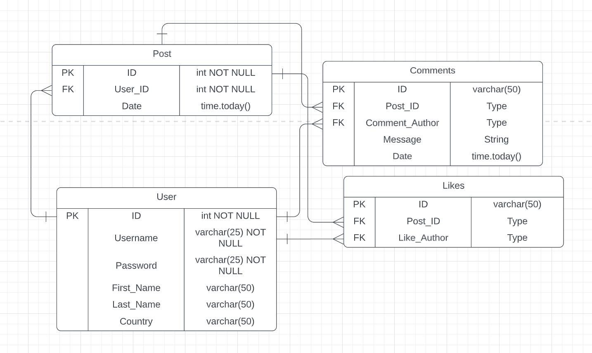

# WilliamOtto_T2A1
## Q1
Flask is a framework that is written in Python. It's purpose is to facilitate the construction of lightweight web applications.

Flask follows the MVC framework. This framework is a design pattern that separates an application into 3 components Model, View and controller. Each component handles a different aspect of development for an application.

Model:
- Models contain all the data logic.
- Models can add or retrieve data from the database.
- Models can respond to requests made by the controller as the controller cant interact with the database directly.

View:
- This component is used to display the user interface for the user.
- Creates a view that is comprised of data that is collected by the model which is then sent through the controller.
- This component only interacts with the controller.

Controller:
- Controllers act as the interconnection between models and views.
- Controllers provide instructions for the models via incoming requests.
- Controllers receive the data back from the models, and send it to the view to render the final output.

https://www.geeksforgeeks.org/mvc-framework-introduction/#:~:text=The%20Model%2DView%2DController%20(,development%20aspects%20of%20an%20application.
https://www.fullstackpython.com/flask.html
https://www.javatpoint.com/flask-tutorial

## Q2
PostgreSQL Overview:

- SQL-compliant database.
- Favoured for its stability.
- Open source.
- 20 years of development adding to its reliability.
- Used as a data store in web, mobile, geospatial and analytical applications.

Pros:

- source code is freely available which enables you to modify it to fit your application.
- features write-ahead logging which provides atomicity and durability.
- has support for geographic objects which allows for the use of location based services and GIS.
- provides you with the ability to comment which aids in the understanding of code, and helps grow the community.
- Extra features with transactions (creating a table, dropping a table, auto table etc.) that other DBMS do not support.
- provides security to parameters as well as app security.
- features can be added to postgres whenever needed e.g. functions, data types, languages, etc.

Cons:

- open source means that receiving publicity is a point of difficulty.
- open source also means that because many different communities manage the software, there can be compatibility issues to do with using features from different contributing comminities.
- having a relational database structure means that reads the data sequentially, starting from the first tuple means that searching for queries is slow.

https://aws.amazon.com/rds/postgresql/what-is-postgresql/
https://www.guru99.com/introduction-postgresql.html#5
https://en.wikipedia.org/wiki/Write-ahead_logging
https://www.aalpha.net/blog/pros-and-cons-of-using-postgresql-for-application-development/

## Q3
The agile project management methodology can be broken down into several steps. These steps are as follows:

1. Setting of project vision:
   - Clearly define the end goal of the agile project, and how it can be achieved.
   - Host meetings with the relevant stakeholders and project managers.
   - Spend up to 16 hours in meetings.

2. Build a product roadmap:
   - A product roadmap is a high level view of the project in which the overall vision is clearly outlined and translated into smaller steps without being too specific.
   - The roadmap should be used to help identify, prioritise and estimate time needed for specific parts of the project.
   - The product roadmap should include a loose timeframe, the requirements, and updated user stories.

3. Create a release plan:
   - A release plan is used to anticipate which components need priority and which components can be released at a later time.
   - A high level timetable should be created by the product owner to help streamline the process.

4. Sprint planning:
   - A sprint is a short period of development where specific tasks are carries out.
   - Before a sprint begins, your team should create a list of backlog items that need to be completed in the timeframe.

5. Complete daily standups:
   - Standups are used to monitor the progress of individuals working on the project.
   - Daily meeting lasting from 10-15 mins should be sufficient.
   - In a standup meeting, individuals should discuss 3 things; what was completed yesterday; what is being worked on today; are there any roadblocks preventing progress.

6. Sprint reviews:
   - At the end of a sprint, it is necessary to compare the resulting piece of software to the original plan.
   - Questions as to whether the software did or did not deviate from the original plan should be asked to help optimize future sprints and more successfully hit targets.

7. Decide what comes next:
   - Starting on the next sprint immediately after the previous one is essential for an agile project.
   - Use a sprint retrospective where you reflect on the process of the previous sprint.
   - Think about things such as; was the plan followed, was the workload manageable, where is there room for improvement and was there something that has changed the timeline of the original project.

After the sprint retrospective, the sprint process repeats, and anything learnt from the previous sprint should be utilized.

https://plan.io/blog/what-is-agile-project-management/#step-1-set-your-project-vision-and-scope-with-a-planning-meeting

## Q4
Feature branch workflow is the idea that the development of all features should take place on a branch that is specific for the task, separated from the main branch. This is called encapsulation, and used extensively when multiple developers are involved in a project, and prevents them from accidentally changing the code base. This means that the main branch will never contain broken code. Encapsulation allows for the leveraging of pull requests whereby a developer initiates a discussion about the feature they are working on. This means that other developers can sign off on the work of another that developer, or if there is a roadblock, the developer can make a pull request to ask for help from another developer.

Git Feature Branch Workflow works by assuming that there is a central repo. Instead of committing on the main branch, developers create a new branch every time they start work on a new feature. These branches should have descriptive names to make them easy to distinguish. These branches should then be pushed to the central repo to enable the sharing of this code with other developers.

https://www.atlassian.com/git/tutorials/comparing-workflows/feature-branch-workflow

## Q5
Unit testing is a testing process where testing is conducted on the smallest piece of code that can be isolated in a system, otherwise known as a unit. Things that can be classified as units include functions, subroutines and methods.

Unit testing has the following advantages:

- Unit testing has the advantage of finding problems in the earlier in the dvelopment cycle.
- Assists developers with the understanding of the code base which makes it easier to make changes.
- Helps with reusing code for other projects where the same units are used. Migrating both the code and the test can speed things up.
- Allows developers to refactor code at a later date which to conduct a regression test.
- Lets parts be tested individually which can speed up development.

https://smartbear.com/learn/automated-testing/what-is-unit-testing/
https://www.guru99.com/unit-testing-guide.html

## Q6
The CIA triad is a model that is used to form the basis for security systems. The 3 letters of CIA stand for Confidentiality, Integrity and Availability.

Confidentiality:
This component pertains to the efforts of an organisation to make sure data is kept private. This is achieved by controlling access to information, allowing individuals to access only what they are permitted to access.

Integrity:
Integritry refers to the trustworthiness of data. This means that data must be accurate and protected from tampering.

Availability:
Availability refers to how accessible data is. If the confidentiality and intergrity are both maintained, availability is an important third step in ensuring users have easy access to that information. This means that the data should remain fully-functional even during abnormal circumstances.

https://www.fortinet.com/resources/cyberglossary/cia-triad

## Q7
One method of protecting the confidentiality of data is to use multi-factor authentication. This is a method of authentication which requires more than one piece of personal information from the user to access the data. It provides an added layer of security.

One method of protecting data integrity is called non-repudiation. This means that a sender or receiver of information, where the transaction has a proof of delivery can not be repudiated by either party at a later time.

To protect against a loss of availability to data, one approach would be to make sure software and security systems are frequently upgraded. Backups are essential to protect data availability in the event of a disaster.

https://www.cyber.gov.au/mfa
https://csrc.nist.gov/glossary/term/non_repudiation#:~:text=Definition(s)%3A,deny%20having%20processed%20the%20information.
https://www.fortinet.com/resources/cyberglossary/cia-triad

## Q8
In general, businesses are only responsible for data if they are declared to be APP compliant.

The following is a list of requirements under the Privact Act (1988) that pertain to protection of personal information as an APP entity:

- APP entities must not use the data for any purpose other than what it was originally intended.
- APP entities must give users the option to withhold identifying themselves.
- APP entities are allowed to collect personal and sensitive information.
- APP entities must deal with unsolicited information in a specific way.
- APP entities must notify users that they have collected their personal information.
- APP entities can not use personal information for marketing purposes.
- APP entities must ensure that overseas recipients comply with the same privacy standard when sending personal information.
- APP entities must take reasonable steps in ensuring that the personal information is up to date, accurate and complete.
- APP entities must destroy data that is no longer required.
- APP entities must provide the personal information of a user to them upon request.

ACME must adhere to all of the above requirements provided they are considered an APP entity. As an aside, it is recommended that the appropriate security protocols are put in place to protect the data.

https://www.eway.com.au/blog/are-you-personally-liable-if-your-business-suffers-a-data-breach/
https://www.legislation.gov.au/Details/C2022C00199
https://www.landers.com.au/legal-insights-news/terralex-guide-to-data-protection-2021

## Q9
Definitions:

- Attributes (columns)
- Tuple (rows)
- Relation Schema (name of relation with attributes)
- Degree (total number of attributes)
- Cardinality (number of rows)
- Column (set of values for a given attribute)
- Relation Instance (a set of tuples)
- Relation Key (all the attributes for a specific row)
- Attribute Domain (scope and domain of the attribute)

The relational model has two main parts, the relation heading, and the relation body. The heading is a set of attributes that are all individually paired with a domain. A example of an attribute would be ID and a domain would be integer.

A relation body is a set of rows which each represent an instance of the relation being looked at. If for example the relation is with regards to employee information, the relation body would contain an individual employees' information on each row.

http://diranieh.com/Database/RelationalDatabaseModel.htm#Relational%20Model:%20Data%20Integrity
https://www.guru99.com/relational-data-model-dbms.html

## Q10
The integrity of the data in the relational database model refers to the conditions which must be present for a valid relation. These constraints fall into three categories.

1. Domain Constraints:
   - The domain is the type of data used by an attribute.
   - Can be violated if an attribute value contains an incorrect data type or if it isn't in the corresponding domain.
   - To avoid, ensure the attribute value matches the data type.
2. Key Constraints:
   - A key is an attribute that uniquely identifies the tuple such as an ID.
   - Can ve violated if the keys are not unique.
   - To avoid, ensure each key is unique.
3. Referential Integrity Constraints:
   - Can be violated if a key attribute(foreign key) in another relation is different from its own key.
   - To avoid, ensure each key corresponds to a foreign key with the same value.

https://www.guru99.com/relational-data-model-dbms.html#6

## Q11
There are four main types of data manipulation in the relational database model. These types of manipulation can be expressed using the acronym CRUD:

- Create or Insert: Adds one or more tuples to a relation.
- Read or Select: Retrieve tuples from a relation.
- Update: Modifies one or more tuples in a relation.
- Delete: Removes one tuples from a relation.

These types of manipulation are the main ways or performing operations on a relational database.

## Q12

a.

- Python
- MySQL
- HAProxy
- NGINX
- Amazon S3
- Amazon EC2
- Memcached
- Amazon SQS
- Amazon EBS
- Zepto

https://stackshare.io/quora/quora

b. Quora uses AWS via Amazon EC2 to host their servers. Amazon EC2 is a cloud based web service that allows the remote hosting of a web application through the use of one of the virtual machines that are owned by Amazon. The servers that operate behind the EC2 service are located in 30 regions around the world with 96 availability zones within these regions, covering over 245 countries.

https://aws.amazon.com/about-aws/global-infrastructure/

c. Quora uses MySQL as its database. Memcached is used as MySQL's caching layer which improves speeds by caching data and objects in RAM. Git is used for version control for the entire system. Webnode2 and livenode are Quora's internal systems which generate JavaScript HTML and CSS, and is tightly coupled with livenode which all work in conjunction with one another to display the content of the webpage. HAProxy manages the load balancing for incoming connections, and behind that is NGINX which is a reverse proxy server. This is used to foward browser requests to the back end applications. Python is the general development language of choice, used in the back-end.

https://en.wikipedia.org/wiki/Memcached
https://www.nginx.com/resources/glossary/load-balancing/
https://nginx.org/en/
https://en.wikipedia.org/wiki/Reverse_proxy

d. Quora likes to keep its data on one machine if possible, using the hash of the primary key to partition larger datasets across multiple databases and minimizing the use of joins between different databases.

e. Quora needs to track things like the movement of users in the app (real user monitoring). Things in this category include all data associated with the activity of a user (login, personal info, session time, posts, comments, likes etc.). Application Performance Monitoring (APM) is the process of monitoring the application environment and its performance (tracking requests, tracking errors, tracking traffic, tracking host performance).

https://logicalread.com/how-to-efficiently-monitor-your-web-application/#.Y32Mw-xBzdo

f. Users are related to performance of the web app through the demand they create on the servers. When a user create a request, they put a load on the servers which can alter the performance of the application, subsequently effecting the UX.

g. 
# WilliamOtto_T2A1
